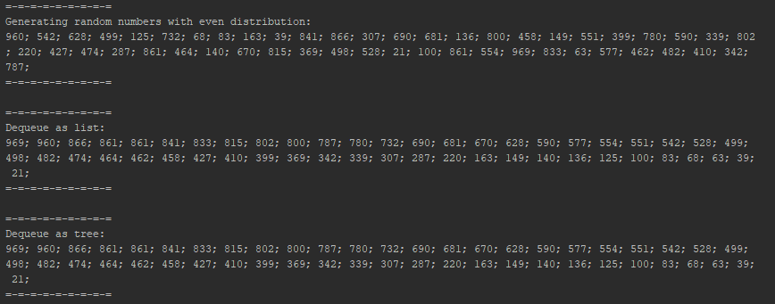
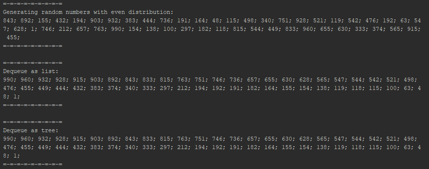
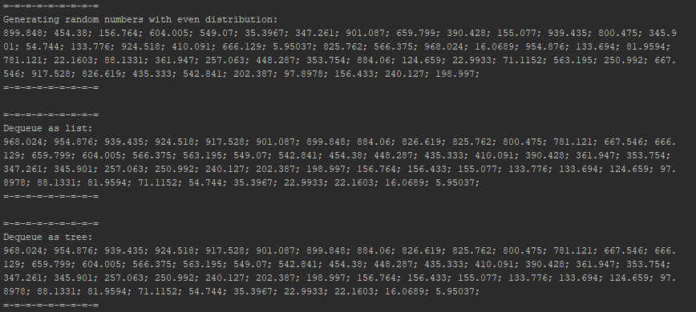

# Priority Queue

Priority queue is an exercise we were asked to make for our course in the Collage.

## Requirements

  - All of the requirements were given on the PDF page given by the instructor.

## External code / Libraries

None. All the code was written by us.
(As required by the instructor)

## Screenshots

Running Example #1 - Integral numbers:

Running Example #2 - Integral numbers:

Running Example #3 - Double numbers:

## Authors
  * `Netay Gidnian | id: 315326926 | <netayg@gmail.com>`
  * `Nathan Shain | id: 206026478 | <natanx3996@gmail.com>`